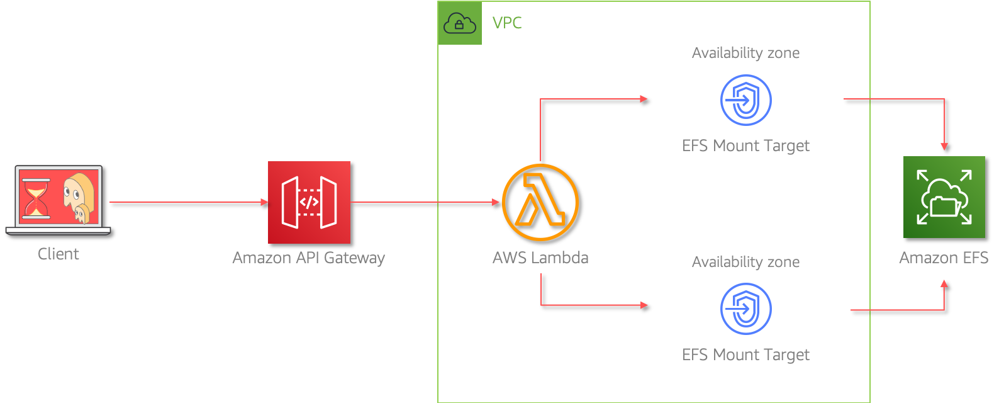

# Serverless Machine Learning API: Use PyTorch in AWS Lambda for Inference

Mystique Unicorn App is a building new application based on microservice architectural pattern. One of the services used by teh app is exposed as an ReST API does machine learning inference. This particular ML model and its depedent libraries need about 3GB of storage space. The dev team had been using lambda for most of their APIs and exposing them using Amazon API Gatway. They are interested in utilizing the same compute & gateway services for this ML api as well.

Currently(_Q3 2020_), the Lambda has only `500MB` of temporary space available and about `250MB` for unzipped layers. [Re:Invent][1] might changes these limites, But the teams is really on keen on getting started now.

Can you help them do that in Amazon API Gateway & AWS Lambda?

## 🎯Solutions

Amazon EFS is a fully managed shared file system that can be attached to a Lambda functions. This allows developers to easily build and import large code libraries directly into your Lambda functions, share data across function invocations. As the files in EFS is loaded dynamically during function invocation, you can also ensure that the latest version of these libraries is always used by every new execution environment.



In this article, we will build an architecture, similar to the one shown above. To bootstrap our EFS with machine learning libraries and models, We will be using an EC2 machine. Once the process of installing and configuring EFS, the EC2 machine can be terminated.

For the machine learning part, we will be using a pre-trained model open sourced by [@nicolalandro][4] available in PyTorch Hub. This model classifies birds using a fine-grained image classifier. We will deploy this model in EFS. When we send the url of the image to the model, it will return us the bird spcies(_broadly speaking_).

1.  ## 🧰 Prerequisites

    This demo, instructions, scripts and cloudformation template is designed to be run in `us-east-1`. With few modifications you can try it out in other regions as well(_Not covered here_).

    - 🛠 AWS CLI Installed & Configured - [Get help here](https://youtu.be/TPyyfmQte0U)
    - 🛠 AWS CDK Installed & Configured - [Get help here](https://www.youtube.com/watch?v=MKwxpszw0Rc)
    - 🛠 Python Packages, _Change the below commands to suit your OS, the following is written for amzn linux 2_

      - Python3 - `yum install -y python3`
      - Python Pip - `yum install -y python-pip`
      - Virtualenv - `pip3 install virtualenv`

      **NOTE**: Given that we are planning to machine learning inferences using Lambda, the lambda function needs enough compute and memory to return a response in reasonable time. The automation in this repo, sets up lambda with `3008MB` memory and `5 Minutes` timeout. In addition to that, we will also be configuring `Provisioned Concurrency` <sup>[2]</sup> for our lambda function to avoid cold starts.

      Obviously, there has been no attempt made to optimize these settings, as this just a technology demonstration. Given the above reasons and other resources like EC2, please be mindful of the costs involved in deploying and learning from this stack.

1.  ## ⚙️ Setting up the environment

    - Get the application code

      ```bash
      git clone https://github.com/miztiik/serverless-machine-learning-api
      cd serverless-machine-learning-api
      ```

1.  ## 🚀 Prepare the dev environment to run AWS CDK

    We will cdk to be installed to make our deployments easier. Lets go ahead and install the necessary components.

    ```bash
    # If you DONT have cdk installed
    npm install -g aws-cdk

    # Make sure you in root directory
    python3 -m venv .env
    source .env/bin/activate
    pip3 install -r requirements.txt
    ```

    The very first time you deploy an AWS CDK app into an environment _(account/region)_, you’ll need to install a `bootstrap stack`, Otherwise just go ahead and deploy using `cdk deploy`.

    ```bash
    cdk bootstrap
    cdk ls
    # Follow on screen prompts
    ```

    You should see an output of the available stacks,

    ```bash
    vpc-stack
    efs-stack
    pytorch-on-efs
    serverless-machine-learning-api
    ```

1.  ## 🚀 Deploying the application

    Let us walk through each of the stacks,

    - **Stack: efs-stack**
      We are going to create an EFS share and also create an `/ml` access point that will be used by our lambda function. We also need an VPC to host our EFS, the dependent stack `vpc-stack` will be automatically deployed for you. This stack will also set the `Acl` & `PosixUser` as `1000`.

      To enable communication to our EFS, we will also setup an exclusive security group that allows port `2049` connections over `TCP` from any ip within the VPC. This will allow any EC2 instance and lambda functions within the VPC to read and write to our file share.

      Initiate the deployment with the following command,

      ```bash
      cdk deploy vpc-stack efs-stack
      ```

    - **Stack: pytorch-on-efs**
      To bootstrap our EFS with the machine learning library and models, we need an instance that can write to our EFS share. We will be using an EC2 instance and the `user_data` script to automatically download and install the libraries. The script will install `torch` `torchvision` and `numpy`. The ML model will be downloaded from PyTorch Hub<sup>[3]</sup>

      Initiate the deployment with the following command,

      ```bash
      cdk deploy pytorch-on-efs
      ```

    - **Stack: serverless-machine-learning-api**

      At this point, we are all set to configure our machine learning inference api using AWS Lambda and expose it using API Gateway. This stack:_serverless-machine-learning-api_ do just that for us. It will create the lambda function inside the same VPC as our EFS share. The EFS share will be available for lambda at this mount point `/mnt/inference`. The path for the model and the dependent libraries are set as envionrment variables,

      - `PYTHONPATH` : `/mnt/inference/lib`
      - `TORCH_HOME` : `/mnt/inference/model`

      Since we are also looking to avoid cold starts, the stack will create a versioned lambda and enable a provisioned concurrency of `1`.

      Initiate the deployment with the following command,

      ```bash
      cdk deploy serverless-machine-learning-api
      ```

      Check the `Outputs` section of the stack to access the `MachineLearningInferenceApiUrl`

1.  ## 🔬 Testing the solution

    We can use a tool like `curl` or `Postman` to query the urls. The _Outputs_ section of the respective stacks has the required information on the urls.

    ```bash
    $ WELL_ARCHICTED_API_URL="https://r4e3y68p11.execute-api.us-east-1.amazonaws.com/prod/serverless-machine-learning-api/greeter"
    $ curl ${WELL_ARCHICTED_API_URL}
    {
      "message": "Hello from Miztiikal World, How is it going?",
      "api_stage": "prod",
      "lambda_version": "38",
      "ts": "2020-08-26 13:03:19.810150"
    }
    ```

    We need to append the image url as a query string. Here, couple of sample images of birds(Courstesy of wikimedia<sup>[5]</sup>). Update the `ML_API_URL` and try it out. You can try with other bird images that are publicly accessible.

    ```bash
    $ ML_API_URL="https://ace17f0y9c.execute-api.us-east-1.amazonaws.com/prod/ml-api/identify-bird-species"
    IMG_URL_1="https://upload.wikimedia.org/wikipedia/commons/d/d2/Western_Grebe_swimming.jpg"
    IMG_URL_2="https://upload.wikimedia.org/wikipedia/commons/b/b5/House_Sparrow_%28Passer_domesticus%29-_Male_in_Kolkata_I_IMG_5904.jpg"
    ```

    ```bash
    time curl ${ML_API_URL}?url=${IMG_URL_1}
    ```

    _Expected Output_,

    ```json
    {
      "message": "{'bird_class': '053.Western_Grebe'}",
      "lambda_version": "14",
      "ts": "2020-09-07 17:47:58.469903"
    }
    ```

    ```bash
    time curl ${ML_API_URL}?url=${IMG_URL_2}
    ```

    _Expected Output_,

    ```json
    {
      "message": "{'bird_class': '118.House_Sparrow'}",
      "lambda_version": "14",
      "ts": "2020-09-07 17:49:46.138871"
    }
    ```

    It is possible that the first invocation takes slightly longer(_even maybe timing out at API GW_) as the function has initialize with libraries and models from EFS. Subsequent invocations should be significantly lower at around `~ 3 seconds`.

    _Additional Learnings:_ You can check the logs in cloudwatch for more information or increase the logging level of the lambda functions by changing the environment variable from `INFO` to `DEBUG`

1.  ## 📒 Conclusion

    Here we have demonstrated how to use EFS share with Lambda as a persistent storage. Here are few other use cases that you can try with the same pattern,

    - Media processing with `ffmpeg`: For example - Keyframe extraction for highlights etc.,
    - Custom machine learning: For example use `OpenCV` to process of media

1)  ## 🧹 CleanUp

    If you want to destroy all the resources created by the stack, Execute the below command to delete the stack, or _you can delete the stack from console as well_

    - Resources created during [Deploying The Application](#deploying-the-application)
    - Delete CloudWatch Lambda LogGroups
    - _Any other custom resources, you have created for this demo_

    ```bash
    # Delete from cdk
    cdk destroy

    # Follow any on-screen prompts

    # Delete the CF Stack, If you used cloudformation to deploy the stack.
    aws cloudformation delete-stack \
        --stack-name "MiztiikAutomationStack" \
        --region "${AWS_REGION}"
    ```

    This is not an exhaustive list, please carry out other necessary steps as maybe applicable to your needs.

## 📌 Who is using this

This repository aims to teach how to use persistent storage with serverless microservices running on AWS Lambda to new developers, Solution Architects & Ops Engineers in AWS. Based on that knowledge these Udemy [course #1][103], [course #2][102] helps you build complete architecture in AWS.

### 💡 Help/Suggestions or 🐛 Bugs

Thank you for your interest in contributing to our project. Whether it's a bug report, new feature, correction, or additional documentation or solutions, we greatly value feedback and contributions from our community. [Start here][200]

### 👋 Buy me a coffee

[](https://ko-fi.com/Q5Q41QDGK) Buy me a [coffee ☕][900].

### 📚 References

1. [Deep learning inference with AWS Lambda and Amazon EFS][6]

1. [ML with Lambda & EFS][7]

1. [Machine Learning Inference with SageMaker/EFS/Lambda][8]

1. [EFS Performance with Lambda][9]

1. [Video Processing with EFS & Lambda][11]

1. [EFS with AWS Fargate][12]

1. [spaCy Model with Lambda using EFS][13]


### 🏷️ Metadata

**Level**: 300


[1]: https://reinvent.awsevents.com/
[2]: https://aws.amazon.com/blogs/compute/new-for-aws-lambda-predictable-start-up-times-with-provisioned-concurrency/
[3]: https://pytorch.org/hub/nicolalandro_ntsnet-cub200_ntsnet/
[4]: https://github.com/nicolalandro
[5]: https://en.wikipedia.org/wiki/House_sparrow
[6]: https://aws.amazon.com/blogs/compute/building-deep-learning-inference-with-aws-lambda-and-amazon-efs/
[7]: https://aws.amazon.com/blogs/aws/new-a-shared-file-system-for-your-lambda-functions/
[8]: https://medium.com/@shitijkarsolia/setup-serverless-ml-inference-with-aws-lambda-efs-738546fa2e03
[9]: https://lumigo.io/blog/unlocking-more-serverless-use-cases-with-efs-and-lambda/
[10]: https://youtu.be/yfJZc3sJZ8E?t=2405
[11]: https://aws.amazon.com/blogs/compute/using-amazon-efs-for-aws-lambda-in-your-serverless-applications/
[12]: https://aws.amazon.com/blogs/containers/developers-guide-to-using-amazon-efs-with-amazon-ecs-and-aws-fargate-part-1/
[13]: https://towardsdatascience.com/load-a-large-spacy-model-on-aws-lambda-e1999e5e24b5
[100]: https://www.udemy.com/course/aws-cloud-security/?referralCode=B7F1B6C78B45ADAF77A9
[101]: https://www.udemy.com/course/aws-cloud-security-proactive-way/?referralCode=71DC542AD4481309A441
[102]: https://www.udemy.com/course/aws-cloud-development-kit-from-beginner-to-professional/?referralCode=E15D7FB64E417C547579
[103]: https://www.udemy.com/course/aws-cloudformation-basics?referralCode=93AD3B1530BC871093D6
[200]: https://github.com/miztiik/serverless-machine-learning-api/issues
[899]: https://www.udemy.com/user/n-kumar/
[900]: https://ko-fi.com/miztiik
[901]: https://ko-fi.com/Q5Q41QDGK
